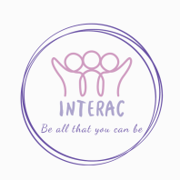
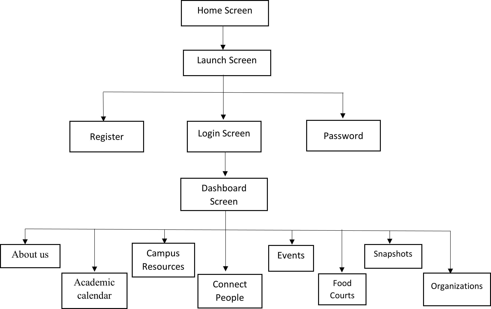

## MobileComputing

### Application Name: INTERAC

### Application Logo

### Team Members:
1.	Trilochan Reddy Sama (Trilochan-Reddy)
2.	Nikhila Chowdary Vaitla (Nikhila212)
3.	Padmavathi Maddukuri (Padmavathi1312)
4.	Sravani Jakkula  (sravanijakkula)

#### Issues
Centralizing all campus-related information in one place. 
This one application can help new and fresher students make their college lives easier and more enjoyable. 
This application will allow students to take advantage of the college's facilities right from the start.
This android project concept is one of those rare ideas that has the potential to change the way people do things and interact with one another.

### Activities
#### Home Screen
It includes the logo and title of the application.
#### Launch Screen
This provides the features of signup and login where the user can sign up if the user enters the application for the first time. And have login option to enter the application if the user is already registered.
#### Register Screen
Here the user id requested to sign up by providing their details like Username, Email Id, password and by default user will be accepting the policies by registering. This also have login option if the user have an account already.
#### LogIn Screen
The login screen allows the user to enter the application using username and password once the user is registered. User can reset the password from this screen if he/she forgets their password. And redirects to signup page if he/she is first time user.
#### Reset Password Screen
Reset screen allows user to provide the new password. Requests for mail id to set new password. With the help of firebase the email gets generated to the user for resetting their password.
#### Dashboard Screen
Dashboard screen gives the actual content of the application with all the widgets available and from here the user can redirect to each individual screen with one click. This screen also have the side navigation bar which displays the Application name and welcome username!!. Logout option for the user is in this navigation bar. 
#### About Us Screen
About us screen describes the information related to the university. Here it contains the details like university establishment information, rewards and awards university received, laptops, textbooks, professional based experiences and contact details of the college. This also includes contact and social media information of the college.
#### Academic Calendar Screen
Academic calendar screen shows the information of the holidays and course start and end dates for current and following academic years. These events may include examination dates, different breaks as per the month.
#### Campus Resources Screen
The campus resources screen provides the information of all the building in the college and their purpose with description. These resources have timings, contact information and year of establishment.
#### Connect People Screen
This screen main purpose is to connect with different people in the college who matches their thoughts using message option provided in the user profile. The user can get the information of the other person from the profile. Here the user can pick the person from different categories like employee, faculty, student, Alumni. This screen have profile which displays the information of the user if he enters in the snapshots screen.
#### Events Screen
Events screens provide information about major events that happened in college the previous year and the list of events that will be held in the current academic year. Also gives information about the recreation activities in the campus. It includes the details about the intramurals, tournaments, competitions, clubs that are in campus for each kind of sport.
#### Food courts Screen
Hangouts screen purpose is to give the user the list of places where all the friends can meet at a single place. It contains information about what are all food courts available and specify their timings to hang out together.
#### Snapshots Screen
Snapshots screen purpose is that an user can upload the beautiful pictures captured by user and provide description of the image which helps in improvising the creativity of the user. In this screen, the description of the image, name and profile of the user who uploaded the image are provided. This screen have an upload option and profile to update their information and upload images.
#### My Profile Screen
This screen provides information about the user. Information can be his/her nickname, category, birthday, gender, description about the user etc.,
15.	Organizations Screen: This screen provides the information about the organizations that are present in the university. It has all the information about them regarding the events organized by them etc.,

### Flow Diagram 

### Sequence Information
1. User will chosse either login or sign up based on whether they have registered or not.
2. If user is new, they will register themselves in the sign up screen.
3. After registering, they will be redirected to login page. They will enter their username and password to login.
4. After successful login, the user will be in dashboard screen where all our screen icons will be present. Based on the wish of user, they can direct to that particular screen by clicking on the icons avaliable.
5. In about us screen we have basic and contact information regarding university.
6. In academic calendar we have all the schedules for the whole year including breaks, holidays etc.
7. In Campus resources we have all the building information in the university along with the timings available and conatct information.
8. In connect people screen, we have all different categories of people like alumni, employees, faculty etc where anyone can connect with them by using their details. This screen would be helpful for freshers.
9. Events screen contain all the information about the events going on in the university.
10. Foodcourts is all about the hangout areas present in the university.
11. Snapshots screen is to upload any picture related to the university. This screen contains profile and upload information.
12. My profile screen is used to update the information about the user which would be visible in the connect people screen for other people.
13. Organizations is about various clubs and organizations present in the university.
14. If the user wants to logout from out application whenever he press back button in a particular screen, they will be redirected to dashboard screen which contains logout option in the side navigation bar.

### Test Credentials
#### User Credentials:
username: sravaninavi@gmail.com 
password: sravs123

### Supported Devices
minSdk 28
targetSdk 32
versionCode 1
versionName "1.0"

### Persistent Data
Firebase databse to store and retrieve data

### Libraries
Android: xml, Java
Server: Firebase
Backend: Firebase by google

### APK
